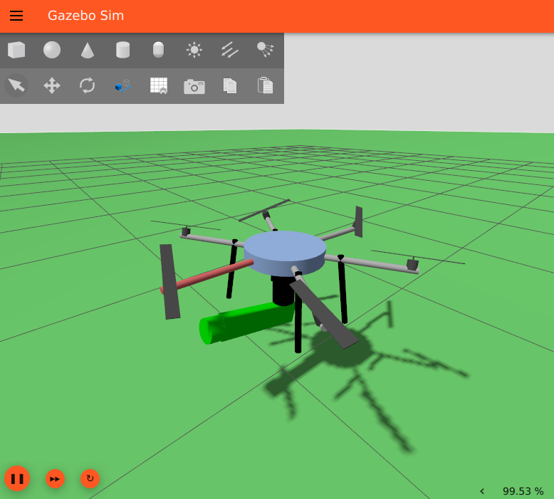

# WAMCtrl-genom3

<p align="center">
  
</p>

**wamctrl** is a [GenoM3](https://git.openrobots.org/projects/genom3)
component for **whole-body aerial manipulation** developed at
[LAAS/CNRS](https://www.laas.fr). It provides whole-body control for a
multi-rotor UAV with a robotic arm, using rigid-body dynamics (via
Pinocchio) for gravity compensation and joint-level tracking.

## Key features

| Feature | Description |
|---|---|
| Whole-body controller | PD + gravity compensation using [Pinocchio](https://github.com/stack-of-tasks/pinocchio) rigid-body dynamics |
| Tilted multi-rotor support | Automatic allocation-matrix computation for Generically Tilted Multi-Rotor Platforms (GTMRP) |
| Emergency descent | Triggers on state-uncertainty thresholds; mass-only open-loop descent |
| URDF loading | Dynamically loads a robot model (free-flyer base + up to 8 joints) |
| Logging | Async file logging of full controller state |

## I/O ports

| Direction | Port | Type | Purpose |
|---|---|---|---|
| **in** | `state` | `or_pose_estimator::state` | Current pose + velocity estimate |
| **in** | `reference` | `or_rigid_body::state` | Desired trajectory |
| **in** | `joints` | `or_joint::state` | Joint (motor) measurements |
| **in** | `rotor_measure` | `or_rotorcraft::output` | Propeller feedback |
| **out** | `rotor_input` | `or_rotorcraft::input` | Propeller velocity commands |
| **out** | `joint_input` | `or_joint::input` | Joint effort commands |
| **out** | `wrench_measure` | `or_wrench_estimator::state` | Estimated wrench |

## Dependencies

- [GenoM3](https://git.openrobots.org/projects/genom3) ≥ 2.99.41
- [openrobots2-idl](https://git.openrobots.org/projects/openrobots2-idl) ≥ 2.0
- [Eigen3](https://eigen.tuxfamily.org) ≥ 3
- [Pinocchio](https://github.com/stack-of-tasks/pinocchio) ≥ 2.3
- [ProxSuite](https://github.com/Simple-Robotics/proxsuite) ≥ 0.6.4
- [urdfdom](https://github.com/ros/urdfdom)

---

# Part I — Installing `wamctrl` with Robotpkg

This part explains how to package and install the GenoM3 component
`wamctrl` using **robotpkg** from a tarball generated from this
repository.

## Prerequisites — Installing robotpkg

Before anything, **robotpkg** itself must be installed on your system.
Follow the official installation guide **exactly** as described here:

> <https://git.openrobots.org/projects/telekyb3/pages/software/install/robotpkg>

That page covers bootstrapping robotpkg, setting the install prefix, and
configuring your environment variables (`ROBOTPKG_BASE`, `PATH`,
`PKG_CONFIG_PATH`, etc.).  Make sure all steps complete successfully
before continuing.

---

## 1. Generate the tarball from the repository

Robotpkg expects release tarballs that already contain the Autotools
build system files (`configure`, `Makefile.in`, …).  These are generated
from `configure.ac` and `Makefile.am`.

### 1.1 Generate the Autotools files

Enter the repository and run:

```bash
cd /path/to/WAMCtrl-genom3
autoreconf -i
```

Verify that the generated files exist:

```bash
ls configure Makefile.in
```

### 1.2 Create the tarball

```bash
cd ..
tar czf WAMCtrl-genom3.tar.gz WAMCtrl-genom3
```

### 1.3 Verify the tarball

```bash
tar tf WAMCtrl-genom3.tar.gz | grep configure
```

Expected output:

```
WAMCtrl-genom3/configure
```

If this file is missing, robotpkg will fail during the configure stage.

---

## 2. Place the tarball in `distfiles`

Move the tarball into robotpkg's `distfiles` directory:

```bash
mv WAMCtrl-genom3.tar.gz ~/src/robotpkg/distfiles/
```

Result:

```
/home/user/src/robotpkg/distfiles/WAMCtrl-genom3.tar.gz
```

Robotpkg will automatically find it there.

---

## 3. Create the package directory

```bash
cd /home/user/src/robotpkg
mkdir -p motion/wamctrl-genom3
cd motion/wamctrl-genom3
```

After all steps the directory will contain:

```
motion/wamctrl-genom3/
├── Makefile
├── DESCR
├── PLIST
└── distinfo
```

---

## 4. Create the `Makefile`

Create `/home/user/src/robotpkg/motion/wamctrl-genom3/Makefile` with the
following contents:

```makefile
# robotpkg Makefile for: motion/wamctrl-genom3

DISTNAME=               WAMCtrl-genom3
CATEGORIES=             motion
MASTER_SITES=           file://${ROBOTPKG_DIR}/distfiles/

MAINTAINER=             user@email.com
HOMEPAGE=               https://example.com
COMMENT=                Genom3 component for near-hovering flight and manipulator control
LICENSE=                2-clause-bsd

GENOM_MODULE=           wamctrl

include ../../architecture/genom3/module.mk

DEPEND_ABI.eigen3+=     eigen3>=3
DEPEND_ABI.pinocchio+=  pinocchio>=2.3
DEPEND_ABI.proxsuite+=  proxsuite>=0.1

include ../../interfaces/openrobots2-idl/depend.mk
include ../../math/eigen3/depend.mk
include ../../math/pinocchio/depend.mk
include ../../optimization/proxsuite/depend.mk

include ../../mk/sysdep/pkg-config.mk
include ../../mk/language/c.mk
include ../../mk/language/c++.mk
include ../../mk/robotpkg.mk
```

> **Important:** `robotpkg.mk` **must** be the last include.
> `MASTER_SITES` points to the local `distfiles` directory — robotpkg
> automatically appends the tarball name.

---

## 5. Create the `DESCR` file

Create `/home/user/src/robotpkg/motion/wamctrl-genom3/DESCR`:

```
wamctrl is a Genom3 component derived from nhfc.
It provides near-hovering flight control functionality plus control of
a robotic manipulator.
```

---

## 6. Generate `distinfo`

Robotpkg requires checksums for the tarball.  Run:

```bash
make distinfo
```

This generates the `distinfo` file containing SHA1, RMD160 and file-size
checksums.

---

## 7. Build the package

Compile the component:

```bash
make
```

Robotpkg will automatically execute the stages:
**fetch → extract → patch → configure → build**.

---

## 8. Generate `PLIST`

Robotpkg needs to know which files the package installs.  Run:

```bash
make print-PLIST
```

This creates `PLIST.guess`.  Rename it:

```bash
mv PLIST.guess PLIST
```

Review and clean the list if necessary.

---

## 9. Install the component

```bash
make update
```

or equivalently:

```bash
make install
```

---

## 10. Clean the build directory

```bash
make clean
```

---

## Final package layout

```
/home/user/src/robotpkg/motion/wamctrl-genom3/
├── Makefile
├── DESCR
├── PLIST
└── distinfo

/home/user/src/robotpkg/distfiles/WAMCtrl-genom3.tar.gz
```

---

# Part II — Running an Aerial Manipulator Simulation

This tutorial provides a set of ready-to-use sample files and scripts
that should get you started flying your first **aerial manipulator** in
simulation.  It is not meant to be an exhaustive reference manual.

## Table of contents

- [Required components](#required-components)
- [Starting the simulation](#starting-the-simulation)
- [Controlling via a Python script](#controlling-via-a-python-script)
- [Getting further](#getting-further)

---

## Required components

Before anything else the following components should be installed on
your system.

### Software architecture

| Component | Description |
|---|---|
| **rotorcraft-genom3** | Low-level hardware controller for multi-rotor robots talking the telekyb3 protocol. |
| **wamctrl-genom3** | Whole-body flight + manipulator controller (this component). |
| **pom-genom3** | State estimation by fusion of multiple sensors (IMU, GPS, motion capture, …). |
| **optitrack-genom3** | Driver for an Optitrack motion capture system. |
| **dynamixel-genom3** | Driver for Dynamixel servo motors (robotic arm joints). |

### Simulation software

| Component | Description |
|---|---|
| **mrsim-gazebo** | A Gazebo plugin for multi-rotor simulation. |
| **optitrack-gazebo** | A Gazebo plugin for motion capture simulation. |

### Supervision software

| Component | Description |
|---|---|
| **genomix** | HTTP server providing a generic interface between clients and GenoM components. |
| **python3-genomix** | Python package for controlling GenoM components. |

Refer to the
[software installation instructions](https://git.openrobots.org/projects/telekyb3/pages/software/install/robotpkg)
for details.  In particular, if you use robotpkg and the package sets
described in the documentation, you can install the desired components
by installing the package sets **telekyb3**, **simulation** and
**genom3**, plus the `wamctrl-genom3` package built in Part I. **Pinocchio** can also be installed via robotpkg.

---

## Installing the example files

This repository includes ready-to-use simulation files in the
`example_files/` directory.  Before running the simulation, copy them
into the appropriate locations under your openrobots prefix.

### Gazebo world

Copy the world file to the Gazebo worlds directory:

```bash
cp example_files/example_plus_arm.world \
   ~/openrobots/share/gazebo/worlds/
```

### Gazebo model

Copy the aerial manipulator model to the Gazebo models directory:

```bash
cp -r example_files/mrsim-tilthex-plus-arm \
     ~/openrobots/share/gazebo/models/
```

### URDF for the whole-body controller

The URDF file is used by Pinocchio inside wamctrl for dynamics
computation.  Copy it to a convenient location — for example, alongside
the Gazebo models:

```bash
cp example_files/tilthex_plus_arm_primitive_pinocchio.urdf \
   ~/openrobots/share/gazebo/models/
```

You will point `wamctrl.set_urdf()` to this path later in the Python
script (see below).

> **Tip:** You can place the URDF anywhere on your filesystem; just make
> sure the path passed to `wamctrl.set_urdf()` matches.

---

## Starting the simulation

Once everything is installed and the example files are in place, use the
following shell script to start all the required software.  Save it as
`wamctrl-simulation.sh` (or download it from the examples directory).

> **Note:** The script uses the **pocolibs** middleware and the
> `$HOME/openrobots` prefix by default.  Tune it if you changed the
> defaults.

### Sample aerial manipulator simulation startup script

```bash
#!/bin/sh

# settings
middleware=pocolibs # or ros
components="
  rotorcraft
  wamctrl
  pom
  optitrack
  dynamixel
"
gzworld=$HOME/openrobots/share/gazebo/worlds/example_plus_arm.world

export GZ_SIM_RESOURCE_PATH=$HOME/openrobots/share/gazebo/models
export GZ_SIM_SYSTEM_PLUGIN_PATH=$HOME/openrobots/lib/gazebo


# list of process ids to clean, populated after each spawn
pids=

# cleanup, called after ctrl-C
atexit() {
    trap - 0 INT CHLD
    set +e

    kill $pids
    wait
    case $middleware in
        pocolibs) h2 end;;
    esac
    exit 0
}
trap atexit 0 INT
set -e

# init middleware
case $middleware in
    pocolibs) h2 init;;
    ros) roscore & pids="$pids $!";;
esac

# optionally run a genomix server for remote control
genomixd & pids="$pids $!"

# spawn required components
for c in $components; do
    $c-$middleware & pids="$pids $!"
done

# start gazebo
gz sim $gzworld & pids="$pids $!"

# wait for ctrl-C or any background process failure
trap atexit CHLD
wait
```

To start all the required components, simply run the script:

```bash
$ sh ./wamctrl-simulation.sh
Initializing pocolibs devices: OK
[...]
gz sim server: mrsim created /tmp/pty-hr6
```

This should start all the components and finally a Gazebo client showing
the aerial manipulator (a hexarotor with a robotic arm).

To stop the simulation, hit **Ctrl-C** in the terminal where the script
is running.

---

## Controlling via a Python script

To control the running simulation, use the following Python script.
Save it as `wamctrl-control.py`.

### Sample aerial manipulator Python control script

```python
import os
import genomix
import sys
from pathlib import Path
import numpy as np
import pinocchio as pin
from time import sleep

# --- Config ---------------------------------------------------------------
RPATH = os.path.expanduser('~/openrobots/lib/genom/pocolibs/plugins')
SERIAL = '/tmp/pty-hr6'   # adapt to your endpoint
# SERIAL = '/dev/ttyACM0'
BAUD = 0
N_ROTORS = 6              # <= 8 supported by the component
LOG_DIR = '/tmp'

# --- Genomix / component --------------------------------------------------
g = genomix.connect('localhost:8080')  # match your genomixd port
# g = genomix.connect('neophasia-wifi')
g.rpath(RPATH)
optitrack = g.load('optitrack')
rotorcraft = g.load('rotorcraft')
mj = g.load('dynamixel')
pom = g.load('pom')
wamctrl = g.load('wamctrl')

# --- Lifecycle ------------------------------------------------------------
def setup():
    """Configure all components. Call this first."""

    # optitrack
    #
    # connect to the simulated optitrack system on localhost
    optitrack.connect({
        'host': 'localhost',
        'host_port': '1509',
        'mcast': '',
        'mcast_port': '0'
    })

    # dynamixel
    #
    # connect to the simulated arm and read joint commands from wamctrl
    mj.connect('/tmp/pty-boomslang')
    mj.connect_port({'local': 'joint_input', 'remote': 'wamctrl/joint_input'})

    # rotorcraft
    #
    # connect to the simulated hexarotor
    rotorcraft.connect({'serial': SERIAL, 'baud': BAUD})

    # get IMU at 1kHz and motor data at 20Hz
    rotorcraft.set_sensor_rate({'rate': {
        'imu': 1000, 'mag': 0, 'motor': 20, 'battery': 1
    }})

    # Filter IMU: 20Hz cut-off frequency for gyroscopes and 5Hz for
    # accelerometers. This is important for cancelling vibrations.
    rotorcraft.set_imu_filter({
        'gfc': [20, 20, 20], 'afc': [5, 5, 5], 'mfc': [20, 20, 20]
    })

    # read propellers velocities from wamctrl controller
    rotorcraft.connect_port({
        'local': 'rotor_input', 'remote': 'wamctrl/rotor_input'
    })

    # pom
    #
    # configure kalman filter
    pom.set_prediction_model('::pom::constant_acceleration')
    pom.set_process_noise({'max_jerk': 100, 'max_dw': 50})

    # allow sensor data up to 250ms old
    pom.set_history_length({'history_length': 0.25})

    # configure magnetic field
    pom.set_mag_field({'magdir': {
        'x': 23.8e-06,
        'y': -0.4e-06,
        'z': -39.8e-06
    }})

    # read IMU and magnetometers from rotorcraft
    pom.connect_port({'local': 'measure/imu', 'remote': 'rotorcraft/imu'})
    pom.add_measurement('imu')

    pom.connect_port({'local': 'measure/mag', 'remote': 'rotorcraft/mag'})
    pom.add_measurement('mag')

    # read position and orientation from optitrack
    pom.connect_port({
        'local': 'measure/mocap', 'remote': 'optitrack/bodies/HR_6'
    })
    pom.add_measurement('mocap')

    # wamctrl
    #
    # set path to the URDF (will be loaded in start())
    wamctrl.set_urdf(
        os.path.expanduser(
            '~/openrobots/share/gazebo/models/'
            'tilthex_plus_arm_primitive_pinocchio.urdf'
        )
    )

    # configure hexarotor geometry: 6 rotors, tilted -20°, 39cm arms
    wamctrl.set_gtmrp_geom({
        'rotors': 6,
        'cx': 0,
        'cy': 0,
        'cz': 0,
        'armlen': 0.39,        # sqrt(0.38998² + 0²) from URDF positions
        'mass': 2.72,          # base (2.3) + arm_base (0.412)
        'mbodyw': 0.27,        # 2 * cylinder radius 0.1354
        'mbodyh': 0.05,        # cylinder height from URDF
        'mmotor': 0.07,        # from rotor inertial mass
        'rx': -20,             # -0.349 rad = -20° (first rotor tilt)
        'ry': 0,
        'rz': -1,              # CW for first rotor
        'cf': 13.0e-4,         # from URDF plugin (NOT 6.5e-4!)
        'ct': 1.996e-5         # from URDF plugin (NOT 1e-5!)
    })

    # emergency descent parameters
    wamctrl.set_emerg({'emerg': {
        'descent': 0.1, 'dx': 0.5, 'dq': 1, 'dv': 3, 'dw': 3
    }})

    # PID tuning
    wamctrl.set_saturation({'sat': {'x': 1, 'v': 1, 'ix': 0}})
    wamctrl.set_servo_gain({'gain': {
        'Kpxy': 5, 'Kpz': 5, 'Kqxy': 4, 'Kqz': 0.1,
        'Kvxy': 6, 'Kvz': 6, 'Kwxy': 1, 'Kwz': 0.1,
        'Kixy': 0, 'Kiz': 0
    }})

    # use tilt-prioritized controller
    wamctrl.set_control_mode({'att_mode': '::wamctrl::tilt_prioritized'})

    # read measured propeller velocities from rotorcraft
    wamctrl.connect_port({
        'local': 'rotor_measure', 'remote': 'rotorcraft/rotor_measure'
    })

    # read current state from pom
    wamctrl.connect_port({
        'local': 'state', 'remote': 'pom/frame/robot'
    })

    # read joint measurements from dynamixel
    wamctrl.connect_port({
        'local': 'joints', 'remote': 'dynamixel/motors'
    })


def start():
    """Load the URDF, start motors, and begin servoing. Call after setup()."""

    # load the whole-body model from the URDF set during setup()
    wamctrl.load_urdf()

    # configure whole-body PD gains
    wamctrl.set_wholebody_gains({
        'Kp_base': [10, 10, 10, 10, 10, 10],
        'Kd_base': [5, 5, 5, 5, 5, 5],
        'Kp_joint': [1, 1, 0, 0, 0, 0, 0, 0],
        'Kd_joint': [0.3, 0.3, 0, 0, 0, 0, 0, 0]
    })

    # enable logging
    pom.log_state('/tmp/pom.log')
    pom.log_measurements('/tmp/pom-measurements.log')
    optitrack.set_logfile('/tmp/opti.log')
    rotorcraft.log('/tmp/rotorcraft.log')

    # spin up the rotors and start the servo loops
    rotorcraft.start()
    rotorcraft.servo(ack=True)

    # start arm servoing
    mj.servo(ack=True)


def stop():
    """Stop motors and logging. Call when done."""
    try:
        rotorcraft.stop()
    finally:
        try:
            rotorcraft.log_stop()
        except Exception:
            pass
```

### Running the script

Use `python3 -i` for an interactive session.  After the prompt, call
`setup()` to configure all components, then `start()` to spin the
propellers and begin whole-body control:

```bash
$ python3 -i ./wamctrl-control.py
>>> setup()
>>> start()
>>>
```

You should see the hexarotor propellers spinning and the robot hovering
at ground level with the arm attached.

### Commanding whole-body configurations

To set both the base pose and the arm joint positions simultaneously,
use `wamctrl.set_config()`:

```python
>>> wamctrl.set_config({
...     'x': 0, 'y': 0, 'z': 1,
...     'qx': 0, 'qy': 0, 'qz': 0, 'qw': 1,
...     'qd': [0.5, -0.3, 0, 0, 0, 0, 0, 0]
... })
```

The first seven values (`x`, `y`, `z`, `qx`, `qy`, `qz`, `qw`) define
the desired base pose (position + unit quaternion).  The `qd` array
contains the desired joint positions in radians.

### Tuning the whole-body gains

You can adjust the PD gains at runtime without restarting:

```python
>>> wamctrl.set_wholebody_gains({
...     'Kp_base': [15, 15, 15, 8, 8, 8],
...     'Kd_base': [7, 7, 7, 3, 3, 3],
...     'Kp_joint': [2, 2, 0, 0, 0, 0, 0, 0],
...     'Kd_joint': [0.5, 0.5, 0, 0, 0, 0, 0, 0]
... })
```

The control law is:

$$\tau = g(q) + K_p \cdot e - K_d \cdot \dot{q}$$

where $g(q)$ is the gravity compensation term computed by Pinocchio,
$e$ is the configuration error, and $\dot{q}$ is the generalized
velocity.

### Stopping the simulation

```python
>>> stop()
```

Then hit **Ctrl-C** in the terminal running `wamctrl-simulation.sh`.

---

## Getting further

You can achieve more complex simulations by updating the provided
scripts and adding more components.  For instance:

- The **maneuver-genom3** component can be used to plan feasible
  trajectories and join multiple waypoints.
- The logging system (`wamctrl.log()` / `wamctrl.log_stop()`) records
  the full controller state for offline analysis.
- Wrench saturation weights can be tuned with
  `wamctrl.set_saturation_weights()` to prioritise thrust, tilt or
  heading when the platform reaches its physical limits.

For the full API reference, see the auto-generated documentation in
[README.adoc](README.adoc).
